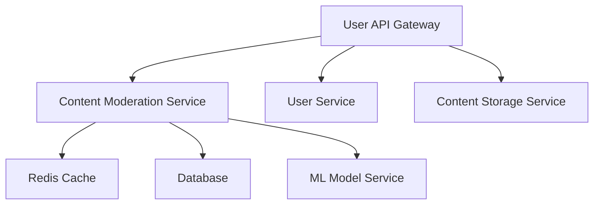

# Docker Implementation

This content moderation system can be easily deployed using Docker, making it simple to run in any environment without worrying about dependencies or configuration.

## Docker Setup

The project includes:
- A `Dockerfile` to build the content moderation system container
- A `docker-compose.yml` file for easy deployment
- Volume mapping for data persistence

### Prerequisites

- [Docker](https://www.docker.com/get-started) installed on your system
- [Docker Compose](https://docs.docker.com/compose/install/) for easier deployment

### Building and Running with Docker

#### Option 1: Using Docker Compose (Recommended)

1. Clone the repository
```bash
git clone https://github.com/yourusername/content-moderation-system.git
cd content-moderation-system
```

2. Build and start the container using Docker Compose
```bash
docker-compose up -d
```

3. Attach to the running container to interact with the application
```bash
docker attach content-moderation-system
```

4. To detach from the container without stopping it, press `Ctrl+P` followed by `Ctrl+Q`

5. To stop the container
```bash
docker-compose down
```

#### Option 2: Using Docker Directly

1. Build the Docker image
```bash
docker build -t content-moderation-system .
```

2. Run the container with interactive mode
```bash
docker run -it --name cms-container content-moderation-system
```

3. For persistence, add a volume
```bash
docker run -it --name cms-container -v cms-data:/app/data content-moderation-system
```

### Custom Configuration

To customize the banned words list before building:

1. Create your own `banned_words.txt` file
2. Uncomment the relevant line in the Dockerfile to copy it:
```dockerfile
COPY banned_words.txt .
```
3. Rebuild the image

## Extending with Microservices

For a production environment, this container can be part of a larger Docker-based microservices architecture:



### Potential Docker Compose Services

```yaml
# Example of extended docker-compose.yml for microservices
services:
  # Our core moderation service
  content-moderation:
    build: .
    # Configuration as shown above
    
  # Add an API gateway for external access
  api-gateway:
    image: nginx:latest
    volumes:
      - ./nginx/nginx.conf:/etc/nginx/nginx.conf
    ports:
      - "80:80"
  
  # Add a database for persistence
  database:
    image: postgres:14
    environment:
      POSTGRES_USER: moderator
      POSTGRES_PASSWORD: secure_password
      POSTGRES_DB: moderation
    volumes:
      - db-data:/var/lib/postgresql/data
  
  # Add a cache for performance
  redis:
    image: redis:6
    volumes:
      - redis-data:/data
```

## Kubernetes Deployment

For production environments requiring high scalability, this Docker container can be deployed to Kubernetes:

```yaml
# Example kubernetes deployment.yaml
apiVersion: apps/v1
kind: Deployment
metadata:
  name: content-moderation-system
spec:
  replicas: 3
  selector:
    matchLabels:
      app: content-moderation
  template:
    metadata:
      labels:
        app: content-moderation
    spec:
      containers:
      - name: content-moderation
        image: your-registry/content-moderation-system:latest
        resources:
          limits:
            memory: "512Mi"
            cpu: "500m"
        volumeMounts:
        - name: moderation-data
          mountPath: /app/data
      volumes:
      - name: moderation-data
        persistentVolumeClaim:
          claimName: moderation-pvc
```

## Health Monitoring

For a production environment, add health monitoring to the container:

1. Modify the C++ application to include a simple HTTP server that responds to health checks
2. Update the Dockerfile to expose the health check port
3. Add health check configuration to docker-compose.yml:

```yaml
services:
  content-moderation:
    # Other configuration
    healthcheck:
      test: ["CMD", "curl", "-f", "http://localhost:8080/health"]
      interval: 30s
      timeout: 10s
      retries: 3
      start_period: 40s
```
