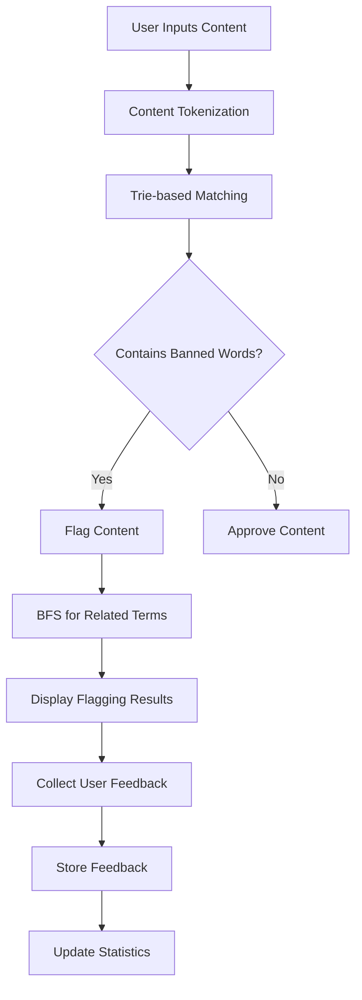
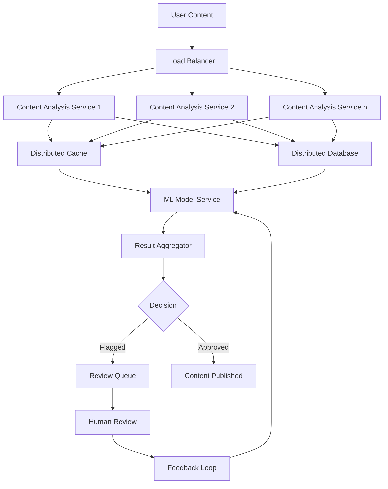

# Dynamic Content Moderation System

## Overview

This project implements a core console-based content moderation system designed to automatically detect and flag inappropriate content in text-based user-generated content. While our current implementation focuses on the fundamental algorithms and data structures required for content detection and flagging, this README provides context on the larger problem space and how this system would scale to handle real-world applications like those used by major tech platforms.


## The Problem

In today's digital landscape, platforms like Facebook, Twitter, YouTube, and other social media networks face an enormous challenge: moderating millions of pieces of user-generated content every second. This content can include:

- Hate speech and harassment
- Violent threats
- Misinformation
- Scams and fraud
- Adult content
- Other forms of harmful material

Manual moderation is:
1. Too slow for real-time interactions
2. Unable to scale to handle millions of users
3. Psychologically taxing on human moderators
4. Inconsistent across different moderators and regions

Our system aims to address these challenges by providing automated, algorithmic content moderation that can:
- Detect inappropriate content in real-time
- Scale to handle large volumes of data
- Adapt to evolving language and contexts
- Incorporate user feedback to continuously improve

## Core Implementation

Our current console application demonstrates the fundamental building blocks of a content moderation system:

### Key Components

1. **Trie-based Content Detection**
   - Uses a Trie (prefix tree) data structure to efficiently store and search for banned words
   - Provides O(m) lookup time where m is the length of the word
   - Enables real-time filtering even for large dictionaries of banned terms

2. **Graph-based Relationship Modeling**
   - Represents relationships between inappropriate terms
   - Models how different harmful terms are connected
   - Reveals potential emerging threats based on term associations

3. **BFS Pathfinding Visualization**
   - Uses Breadth-First Search algorithm to traverse the graph
   - Identifies and displays related inappropriate terms
   - Helps human moderators understand the context of flagged content

4. **Feedback Loop System**
   - Collects user feedback on flagged content
   - Stores data that could be used for system improvement
   - Forms the foundation for an adaptive learning system

### Implementation Flow



### Algorithms and Data Structures

1. **Trie (Prefix Tree)**
   - Used for efficient word lookup
   - Time Complexity: O(m) where m is the length of the word
   - Space Complexity: O(n*m) where n is the number of words

2. **Graph (Adjacency List)**
   - Space Complexity: O(V + E) where V is the number of vertices and E is the number of edges
   - Used to model term relationships

3. **Breadth-First Search (BFS)**
   - Time Complexity: O(V + E)
   - Used to find related terms within a certain distance

4. **Hash Maps**
   - O(1) average lookup time
   - Used for term frequency tracking and relationship storage

### Code Structure

```
ContentModerationSystem
├── TrieNode Class
│   ├── Store banned words
│   └── Efficient lookup
├── Graph Class
│   ├── Store term relationships
│   └── BFS traversal for related terms
└── ContentModerationSystem Class
    ├── loadBannedWords()
    ├── addTermRelationship()
    ├── flagContent()
    ├── processContent()
    ├── collectFeedback()
    ├── visualizeTermGraph()
    └── showStatistics()
```

## Scaling to Enterprise Level

In a production environment at companies like Google, Facebook, or Twitter, this core implementation would be part of a much larger system:

### High-Level Architecture



### Low-Level Components

1. **Content Ingestion Layer**
   - Kafka/RabbitMQ for message queuing
   - Load balancing for horizontal scaling
   - Rate limiting to prevent abuse

2. **Processing Layer**
   - Distributed Trie implementation (sharded by term prefixes)
   - In-memory caching for frequently searched terms
   - Bloom filters for fast negative lookups

3. **ML Enhancement Layer**
   - BERT/GPT models for contextual understanding
   - CNN models for image moderation
   - Embeddings for semantic relationship detection

4. **Storage Layer**
   - Graph databases (Neo4j/TigerGraph) for term relationships
   - Distributed key-value stores for term metadata
   - Time-series databases for trend analysis

5. **Feedback Layer**
   - Active learning for model improvement
   - Human review integration
   - A/B testing for algorithm refinement

## How Major Tech Companies Implement Content Moderation

### Facebook
- Uses a combination of AI and human moderators
- Employs computer vision for image and video content
- Utilizes natural language processing for text analysis
- Implements multi-stage filtering:
  1. Automated pre-screening
  2. Risk-based prioritization
  3. Human review for complex cases
  4. Appeals process

### YouTube
- Uses Content ID for copyright violation detection
- Implements ML models for inappropriate content detection
- Applies community guidelines based on:
  1. Video content
  2. Thumbnail analysis
  3. Comment section monitoring
  4. Channel history and reliability

### Twitter
- Uses ML-based filtering for tweets and direct messages
- Implements graph-based algorithms to detect coordinated harmful activity
- Utilizes behavior patterns to identify bots and spam accounts
- Provides user controls for filtering their experience

## Use Cases

1. **Social Media Platforms**
   - Real-time comment and post moderation
   - Private message scanning for harmful content
   - Group and community management

2. **Online Marketplaces**
   - Product listing moderation
   - Review and feedback filtering
   - Seller communication monitoring

3. **Online Gaming**
   - In-game chat moderation
   - User-generated content filtering
   - Player behavior analysis

4. **Educational Platforms**
   - Student interaction monitoring
   - Assignment submission scanning
   - Discussion forum moderation

5. **Customer Service Systems**
   - Support ticket prioritization
   - Automated response filtering
   - Customer feedback analysis

## Future Enhancements

Our core implementation can be extended with:

1. **Advanced NLP Integration**
   - Sentiment analysis for context understanding
   - Embedding-based similarity for slang detection
   - Language models for contextual understanding

2. **Multi-modal Analysis**
   - Image recognition for visual content moderation
   - Audio transcription and analysis
   - Video content scanning

3. **Distributed Architecture**
   - Sharding for horizontal scaling
   - Replication for fault tolerance
   - Load balancing for performance optimization

4. **Real-time Streaming**
   - Kafka/Kinesis integration for real-time processing
   - Time-window analysis for trend detection
   - Rate limiting and throttling mechanisms

5. **Dashboard and Visualization**
   - Real-time monitoring of system performance
   - Trend analysis and visualization
   - User behavior insights

## Conclusion

Our content moderation system demonstrates the core algorithmic foundations of modern content moderation platforms. While our implementation is focused on a console application showing the essential components, the same principles and algorithms are applied at massive scale by tech giants to moderate billions of content pieces daily.

The use of efficient data structures like Tries and Graphs, combined with algorithms like BFS, forms the backbone of these systems. As content moderation continues to evolve, incorporating machine learning, multi-modal analysis, and sophisticated feedback loops will further enhance these systems' capabilities.

By understanding the fundamentals implemented in our project, developers can gain insight into how large-scale content moderation works and how these principles can be applied to create safer online spaces.

## Getting Started

### Prerequisites
- C++ compiler with C++11 support
- Standard libraries

### Installation
1. Clone the repository
```bash
git clone https://github.com/yourusername/content-moderation-system.git
```

2. Compile the code
```bash
cd content-moderation-system
g++ -std=c++11 main.cpp -o content_moderation_system
```

3. Run the application
```bash
./content_moderation_system
```

## Contributing

Contributions are welcome! Please feel free to submit a Pull Request.
